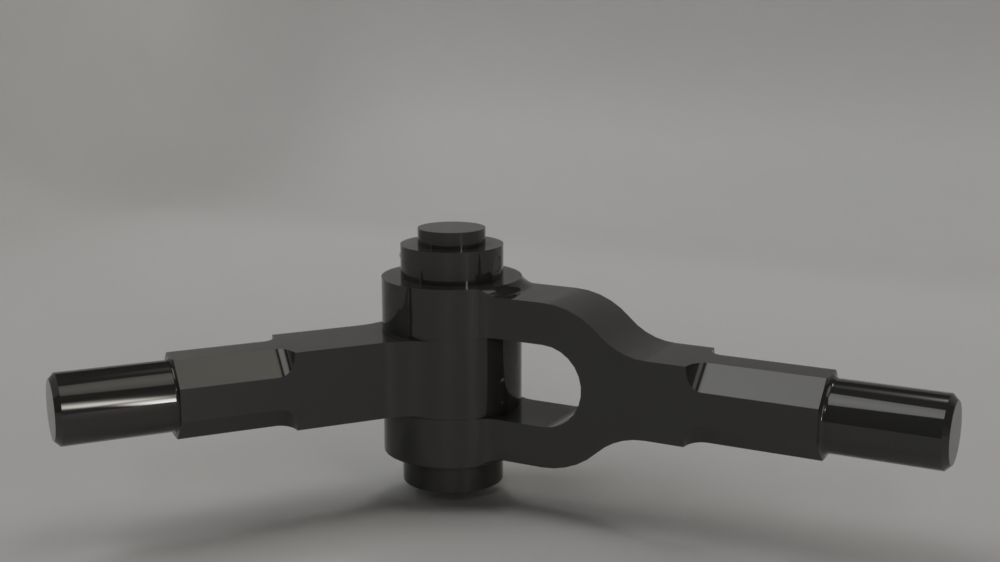

# Knuckle Joint – 3D Assembly Project

## Project Overview

This project demonstrates the design and assembly of a **knuckle joint**, modeled as a collection of individual parts and assembled into a functional mechanical joint. The project focuses on correct part relationships, constraints, and clarity of mechanical structure.

An **exploded view** was also created to clearly illustrate how each component fits together within the assembly.

---

## What Is a Knuckle Joint?

A knuckle joint is a mechanical joint used to connect two rods under tensile load while allowing limited angular movement. It is commonly used in:

* Mechanical linkages
* Automotive and machinery components
* Structural assemblies where flexibility is required

---

## Project Structure

The knuckle joint was created using a **part-based workflow**, where each component was modeled individually and then brought together in an assembly file.

### Main Components:

* Fork end
* Eye end
* Knuckle pin
* Collar / locking element

Each part was modeled separately to ensure:

* Proper tolerances
* Clean constraints
* Reusability of components

---

## Assembly

* All individual parts were assembled using appropriate constraints
* The joint allows realistic rotational movement
* Component alignment reflects real-world mechanical behavior

The assembly file represents the **final functional knuckle joint**.

---

## Exploded View

An exploded view was created to:

* Visualize the relationship between parts
* Show assembly order
* Improve understanding of how the joint is constructed

This is especially useful for:

* Documentation
* Presentations
* Manufacturing or educational purposes

---

## Tools Used

* Autodesk Inventor
* Blender

---

## Project Goals

* Demonstrate correct use of assemblies
* Create a clear and accurate exploded view
* Showcase understanding of mechanical joints

---

## Preview

Below is a rendered view of the assembled knuckle joint:

---

## Notes

* All dimensions and proportions are for demonstration purposes
* The model is intended for educational and visualization use

---

## 📜 License

This project is provided for educational and demonstration purposes. Feel free to reuse or adapt with attribution.
